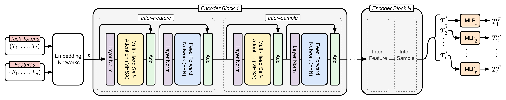

<div align="center">
<h1>MultiTab: A Scalable Foundation for Multitask Learning on Tabular Data</h1>
</div>

<div align="center">

</div>

## Environment Setup

Follow these steps to set up the conda environment for the MultiTab project:

### Prerequisites

- [Anaconda](https://www.anaconda.com/products/distribution) or [Miniconda](https://docs.conda.io/en/latest/miniconda.html) installed on your system
- NVIDIA GPU with CUDA support (recommended for training)

### Installation Steps

1. **Create the conda environment:**
   ```bash
   conda env create -f environment.yml
   ```

2. **Activate the environment:**
   ```bash
   conda activate multitab
   ```

3. **Verify the installation:**
   ```bash
   python -c "import torch; print(f'PyTorch version: {torch.__version__}'); print(f'CUDA available: {torch.cuda.is_available()}')"
   ```

## Dataset Setup Instructions

This project supports three datasets for multitask learning experiments:

- **Higgs Dataset**: High-energy physics dataset for binary classification with additional regression targets
- **ACS Income Dataset**: American Community Survey data for income prediction and demographic analysis  
- **AliExpress Dataset**: E-commerce dataset for click-through rate and conversion prediction

### Setting Up Higgs and ACS Income Datasets (OpenML)

For both Higgs and ACS Income datasets, use the provided preprocessing notebook to automatically download, preprocess, and format the data:

1. **Open the preprocessing notebook:**
   ```
   preprocess_dataset.ipynb
   ```

2. **Configure the dataset (Step 0: Configuration):**
   - For **Higgs dataset**: Uncomment the Higgs `CONFIG` block
   - For **ACS Income dataset**: Uncomment the ACS Income `CONFIG` block
   - Comment out the configuration you're not using

3. **Set the output directory:**
   - Update the `output_dir` in the `CONFIG` to match the `data_root` used in `main.py`
   - This ensures the processed datasets are saved where the training script expects to find them

4. **Configure target variables (Step 3: Configure Target Variables):**
   - For **Higgs dataset**: Uncomment the Higgs `TARGET_CONFIG` block
   - For **ACS Income dataset**: Uncomment the ACS Income `TARGET_CONFIG` block
   - Comment out the target configuration you're not using

5. **Run all cells in the notebook:**
   - The notebook will automatically download the dataset from OpenML
   - Preprocess and format the data
   - Save it in H5 format compatible with the training pipeline
   - Validate the processed dataset

### Setting Up AliExpress Dataset

For the AliExpress dataset, follow these manual steps:

1. **Download the dataset:**
   - Download the dataset from [this Google Drive link](https://drive.google.com/drive/folders/1F0TqvMJvv-2pIeOKUw9deEtUxyYqXK6Y?usp=sharing)
   - Save `AliExpress_NL.zip` to your `data_root` directory

2. **Extract the files:**
   ```bash
   cd <your_data_root>
   unzip AliExpress_NL.zip
   ```
   This should create an `AliExpress_NL` folder with `train.csv` and `test.csv` files.

3. **Preprocess the dataset:**
   - Open `preprocess_aliexpress.ipynb`
   - Update the `data_root` variable in the first cell to point to your data directory
   - Run all cells in the notebook to create the H5 dataset

## Running Experiments

Once you have set up your datasets, you can run experiments using the provided training script:

1. **Make the script executable:**
   ```bash
   chmod +x run.sh
   ```

2. **Configure the experiment parameters:**
   Edit the variables at the top of `run.sh`:
   ```bash
   DATA_ROOT="/path/to/data/"  # Path to your processed datasets
   MODEL_NAME="mtt"            # Model to use (mtt, mmoe, ple, etc.)
   DATASET="acs_income"        # Dataset name (acs_income, higgs, etc.)
   GPU_ID=0                    # GPU ID for training
   SEED=42                     # Random seed for reproducibility
   PATIENCE=5                  # Early stopping patience
   ```

3. **Run the experiment:**
   ```bash
   ./run.sh
   ```

The script will automatically start training with the specified configuration and save results to the logs directory.
